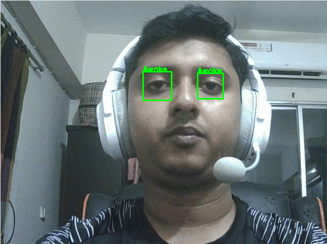

# Driver Fatigue Detection using Computer Vision and Deep Learning

This project aims to detect driver fatigue using computer vision techniques and deep learning models. It employs OpenCV for image processing, TensorFlow/Keras for model development, and Python as the programming language. The system analyzes the driver's eye state to identify signs of fatigue and alerts the driver in real-time.

A research paper preprint on this project has been published and is available at:

DOI: [10.13140/RG.2.2.22111.88481](http://dx.doi.org/10.13140/RG.2.2.22111.88481)

## Demo

## Dataset

The project utilizes the publicly available [MRL Eye Dataset](https://www.kaggle.com/datasets/tauilabdelilah/mrl-eye-dataset), which comprises 84,898 infrared eye images obtained from 37 individuals under various illumination conditions and sensor devices. The dataset is diverse, allowing the model to generalize well to real-world driving scenarios.

## Getting Started

To get started with this project, follow these steps:

1. Clone the repository: `https://github.com/isti2415/Driver-Fatigue-Detection.git`

2. Install the required dependencies: `pip install -r requirements.txt`

3. Download the MRL Eye Dataset from the provided [link](https://www.kaggle.com/datasets/tauilabdelilah/mrl-eye-dataset) and extract it to the `data/` directory within the project folder.

4. Train the deep learning model: `python training.py`

This script will preprocess the dataset, create data generators, and train the convolutional neural network model for fatigue detection.

5. Evaluate the trained model: `python evaluate.py`

This script will evaluate the performance of the trained model on the test dataset, providing metrics such as accuracy, precision, recall, and F1-score. It will also generate visualizations like the confusion matrix and classification report.

6. Run the real-time driver fatigue detection system: `python detection.py`

This script will launch the driver fatigue detection system, which captures video from the webcam, processes each frame using the trained model, and displays the output with visual feedback and audio alerts when fatigue is detected.

## Usage

Once the `detection.py` script is running, the system will display a window showing the real-time video feed from the webcam. It will continuously analyze the driver's face and eyes, classifying their state using the deep learning model.

If the driver's eyes are detected as closed continuously for more than three seconds, the system will trigger an audible alarm and display a "Drowsy" label, indicating that the driver is potentially fatigued and should take a break.

The system also provides visual feedback by outlining the detected face and eye regions on each video frame and displaying a status label ("Alert" or "Drowsy") based on the driver's eye state.

## Contributors

<table>
  <tr>
    <td align="center">
      <a href="https://github.com/isti2415">
         
        Istiaq Ahmed
      </a>
    </td>
    <td align="center">
      <a href="https://github.com/Mahmudul-Islam-0">
         
        Mohammad Mahmudul Islam
      </a>
    </td>
    <td align="center">
      <a href="https://github.com/fasher7">
         
        Fahim Shahriar Eram
      </a>
    </td>
  </tr>
</table>

## License

This project is licensed under the [MIT License](LICENSE).

## Acknowledgments

- The MRL Eye Dataset authors for providing the dataset used in this project.
- The developers of OpenCV, TensorFlow, Keras, and other libraries used in this project.
